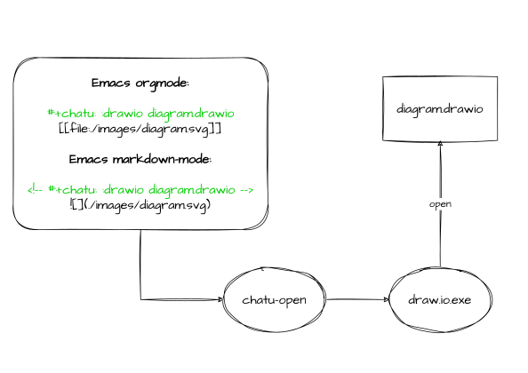
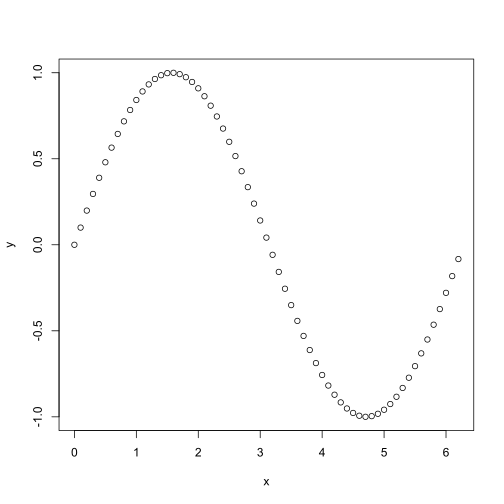

# Insert image converted from drawio file
<!-- #+chatu: :drawio "diagram" -->

<!-- :drawio "diagram" :page 1 -->

<!-- :drawio "diagram" :input-dir "draws" :output-dir "images" :output "diagram.svg" :page 1 -->

# Insert image generated from plantuml file
<!-- #+chatu: :plantuml "plantuml" -->

<!-- :plantuml "plantuml" :page 1 -->

# Insert image generated from babashka script
<!-- #+chatu: :babashka "babashka.bb" -->

# Insert image downloaded by curl
<!-- #+chatu: :curl "https://www.emacswiki.org/pics/official%20gnu.svg" :output "gnu.svg" -->

# R
<!-- #+chatu: :R "chart-r" -->

# Clojure
<!-- #+chatu: :clojure "chart-clj" -->

# Python
<!-- #+chatu: :python "chart-py" -->

# LilyPond
<!-- #+chatu: :lilypond "joy" -->

